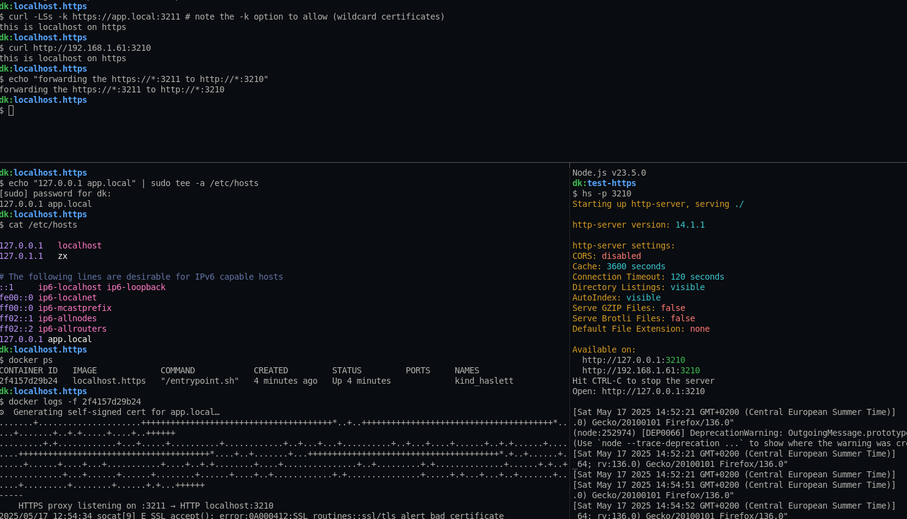

## localhost.https

> ⚠️ DON'T USE THIS IN PRODUCTION,
> it's meant for local tests only.

localhost.https is a basic script to provide https to your localhost/LAN.



### WHY

Currently am working on a project i wanted to test the webcam over LAN, and it looks like "modern browsers" don't allow the WebCam to be connected on an "untrusted" webpage. This sound fair enought for security point of view, but it brings a big problem for makers like me, so i had to find a solution(workaround) for that, following what letsencrypt provide, here we're doing the same tweaks with openssl.

### REQUIREMENTS

- `docker` (if you want to run it with the localhost.https image directly, you can.
- Make sure you have a running app on the target port (APP_PORT), the https server will just forward the traffic there.

- (optional) `make` (either you use Makefile targets or hit yourself directly command line from that file).
- (optional) effective forward based on your `/etc/hosts`
```console
$ echo "127.0.0.1 app.local" | sudo tee -a /etc/hosts
```

### HOW TO USE IT

#### SIMPLE WITH PUBLIC DOCKER IMAGE

```console
$ export APP_PORT="3215"
$ export DOMAIN="app.local"
$ docker run --rm -d --network host -e APP_PORT=$(APP_PORT) -e DOMAIN=$(DOMAIN) sanixdarker/localhost.https:latest
```

#### IF YOU WANT TO BUILD AND YOURSELF

```bash
$ make usage
Usage :
  make build                                        # to docker build the localhost.https image
  make run   APP_PORT=3001 DOMAIN=myapp.local       # APP_PORT and DOMAIN are optionals, defaults will be use if not provided
  make runc  APP_PORT=3001 DOMAIN=myapp.local       # for windows and mac
  make set-forward                                  # to set in /etc/hosts app.local
```

### AUTHOR

- [sanixdk](https://github.com/sanix-darker)
